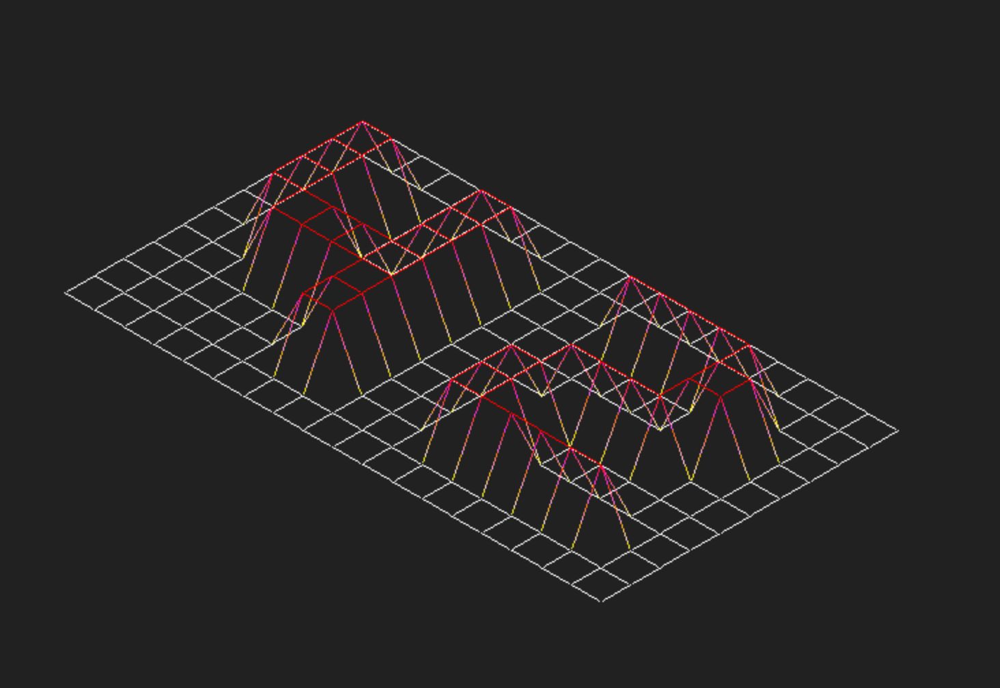
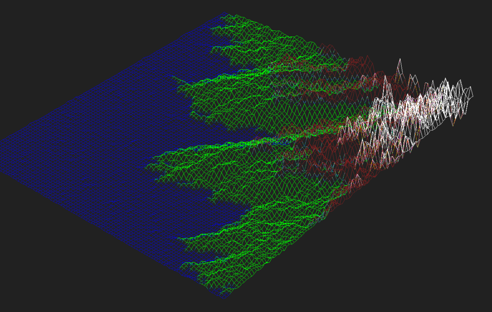
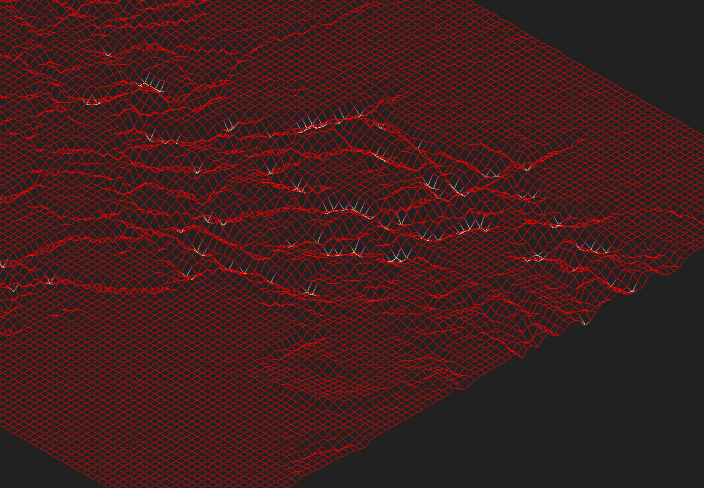

## Учебный проект в "Школе 21" - отрисовка рельефа карты

Задача - отрисовать в изометрии рельеф карты, где заданы координаты и высота в каждой точке.

Используется библиотека minilibx.

Карта задается файлом .fdf (папка test_maps), позиция по горизонтали - координата X, по вертикали - Y, число - Z. Кроме того в точке может быть задан цвет.

Пример карты и изображения:

```
0  0  0  0  0  0  0  0  0  0  0  0  0  0  0  0  0  0  0
0  0  0  0  0  0  0  0  0  0  0  0  0  0  0  0  0  0  0
0  0 10 10  0  0 10 10  0  0  0 10 10 10 10 10  0  0  0
0  0 10 10  0  0 10 10  0  0  0  0  0  0  0 10 10  0  0
0  0 10 10  0  0 10 10  0  0  0  0  0  0  0 10 10  0  0
0  0 10 10 10 10 10 10  0  0  0  0 10 10 10 10  0  0  0
0  0  0 10 10 10 10 10  0  0  0 10 10  0  0  0  0  0  0
0  0  0  0  0  0 10 10  0  0  0 10 10  0  0  0  0  0  0
0  0  0  0  0  0 10 10  0  0  0 10 10 10 10 10 10  0  0
0  0  0  0  0  0  0  0  0  0  0  0  0  0  0  0  0  0  0
0  0  0  0  0  0  0  0  0  0  0  0  0  0  0  0  0  0  0
```



Скомпилировать: `make`

Запустить: `./fdf [путь к карте]`

Например: `./miniRT 42.fdf`

Управление:
+ Стрелки - сдвиг вверх / вниз / влево / вправо
+ Кнопки A, D - поворот изображения
+ W, S - Увеличить / уменьшить
+ 1 - режим изометрии
+ 2 - плоский вид сверху
+ 3 - вид сбоку
+ Esc - выход

Еще примеры изображений разных карт:




